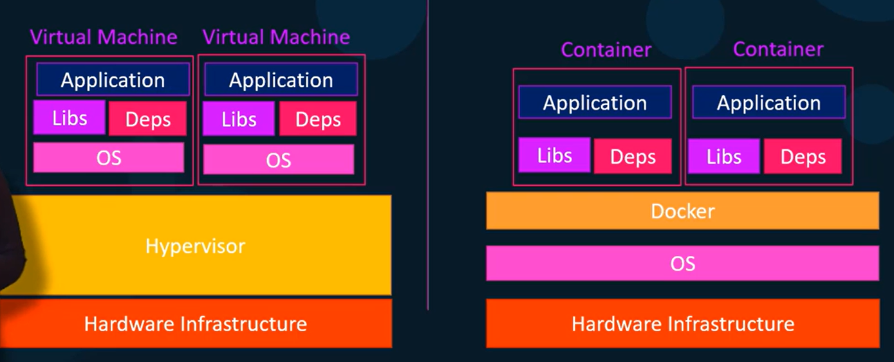

# 1_Introduction
## Overview
### Docker의 필요성
- 앱 스택 개발 시 여러 툴들이 사용 OS와 호환이 되지 않으면 맞는 운영 체제를 찾아야 함
- 라이브러리 의존성 문제
  - 앱 내 각 서비스 별로 필요한 라이브러리의 버전이 다를 수 있음
  - 아키텍쳐 변경 시 컴포넌트 or 인프라 간 호환성을 확인해야 함
  - The Matrix from Hell!
- 신규 멤버 참여 시 개발 환경 구축이 어려움
- 개발 / 테스트 / 배포 환경이 다름
  - 실제 배포 시 원하는 대로 작동 안할 가능성 有

### Docker의 이점
- 컴포넌트가 각자의 의존성과 라이브러리를 갖춘 분리된 컨테이너에서 실행
  - 운영 체제의 상관없이 Docker 환경에서 실행 가능

### 컨테이너
- Docker는 LXC 기술 기반
- 컨테이너 환경은 Low-Level -> 설정 힘듧
- Docker는 이를 쉽게 만들어 주는 툴 제공

### 운영 체제
- OS는 OS 커널과 소프트웨어로 이루어짐
- OS 커널이 같아도 소프트 웨어가 다르면 다른 운영 체제가 됨
- Docker는 설치된 운영 체제의 OS 커널을 사용
- 따라서 해당 OS 커널을 사용하는 운영 체제 실행 가능
- 다른 커널의 OS일 경우 가상 머신에서 실행

### 가상머신 VS 컨테이너

출처) [【한글자막】 초보자를 위한 Docker 실습 - 데브옵스 (DevOps)](https://www.udemy.com/course/docker-hands-on-devops/)
- 가상 머신
  - 여러 개의 운영 체제 사용
  - 기반 리소스 많이 사용
  - 용량을 많이 차지(GB)
  - 부팅 속도 많이 걸림
  - 가상 머신 간 완전히 분리됨
- 컨테이너
  - Docker 환경에서 실행
  - 기반 리소스 적게 사용
  - 용량을 적게 차지(MB)
  - 부팅 속도 적게 걸림
  - 컨테이너 간 여러 리소스 공유
- 여러 가상 머신 내에서 여러 컨테이너를 실행하는 등 각각 맞는 역할에 적용

### Docker in DevOps
- 과거에는 일일이 개발 팀이 운영 팀에게 가이드를 전달해서 배포 환경에서 설정
  - 오래 걸리며 문제가 생길 가능성이 높음
- Docker 사용 시 Docker image로 전달하면 위 문제 해결

## Start Docker
### Windows
- Docker는 기본적으로 리눅스 기반 -> 일반적으로 Windows에서 사용 불가
- Options for Windows
  1. Docker toolbox
       - Oracle Virtualbox와 같은 프로그램을 통해 Linux VM을 설치하고 그 안에 Docker를 설치한다.
       - Windows와 상관이 없기 때문에 관련 작업 불가
  2. Docker Desktop
      - [Docker Desktop Site](https://www.docker.com/products/docker-desktop/)
      - Microsoft Hyper-V
      - Windows 관련 작업 가능 (Windows Containers, image)
      - Container type
        1. Windows Server : 일반적인 Docker와 유사
        2. Hyper-V Isolation : 각 컨테이너가 VM에서 실행되어 컨테이너와 호스트 사이 커널 분리
      - Base Images
        1. Windows Server Core : 무거움
        2. Nano Server : 일부 실행, 가벼움
      - Support
        - Windows Server 2016
        - Nano Server
        - Windows 10 Professional and Enterprise (Hyper-V Isolaed Containers)