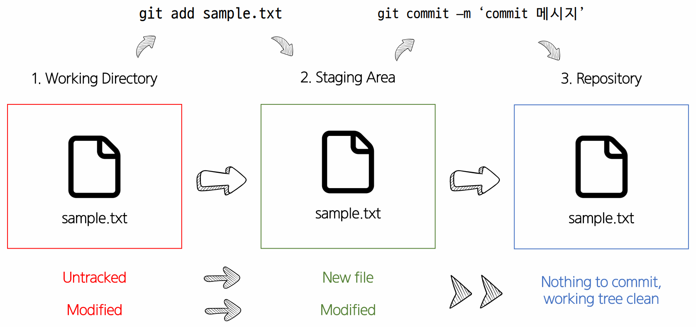

# Git이란
- 분산 버전 관리 시스템이다.
  
# Git의 3개 영역
1. Working Directory
    - 현재 작업 중인 영역
2. Staging Area
    - 버전 관리를 위한 파일, 폴더를 선별하기 위한 임시공간
3. Repository
    - 버전이 저장되는 공간

## git 기본 명령어

- `git init` : git 관리 영역으로의 선언
  -  Caution : git 영역 내부에서 또 선언하지 않기 (submodule)
- `git add {파일명_혹은_경로}` : 작업한 파일이나 폴더를 staging하기 위한 명령어
- `git commit` : 실제 버전을 생성하는 명령어, -m 옵션으로 메세지 입력가능
- `git status` : 현재 상태
  - untracked : 한번도 commit된 적없음
  - modified : commit된 적 있으나 수정됨
  - 붉은색 : unstaging
  - 녹색 : staging
- `git log` : commit 히스토리 출력 --oneline옵션으로 한줄로 출력 가능
- `git config --global -l` : 현재 Git 전체 셜정을 출력