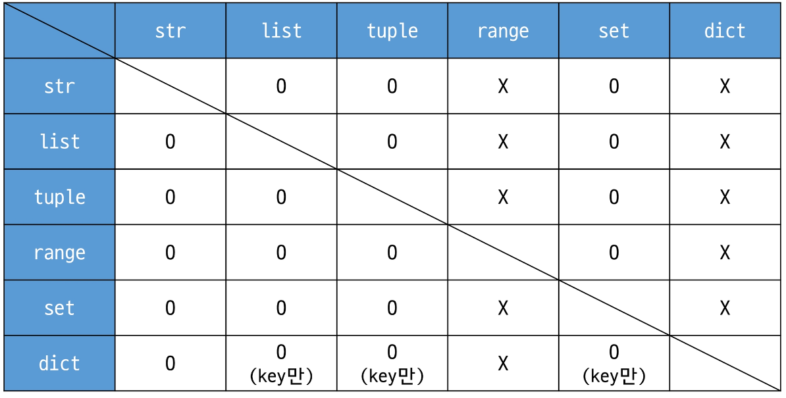

# 01.16.

## 데이터 타입

### Sequence Type

1. **List**
    - 여러 개의 값을 저장하는 변경 가능한 시퀀스 데이터
    - 0개 이상의 객체
    - 표시 `[]`
    - 데이터는 어떠한 거도 가능 ex)`[1, 2, 3, 'python', [1, 2, 3]]`
    - 가변적
2. Tuple
    - 여러 개의 값을 저장하는 변경 가능한 시퀀스 데이터
    - 0개 이상의 객체
    - 표시 `()`
    - 데이터는 어떠한 거도 가능
    - 불변
    - 사용처 : 파이썬 내부 동작 ex) `x, y = 10, 20`
3. range
    - 연속된 정수 시퀀스 **생성**하는 **변경 불가능**한 자료형
    - `range(n)` : 0부터 n-1까지
    - `range(n, m)` : n부터 m-1까지
    - 

### Non Sequence Type

1. Dictionary
    - key - value 쌍 형태의 원소
    - 변경 가능 (value)
    - 순서, 중복 X - 생성할 때 같은 키를 중복해서 입력하면 가장 나중걸로 덮어쓰여짐
    - 표현 `{}`
    - key - 변경 불가능한 자료형
    - value - 모든 자료형
    - key를 통해 값에 접근
2. Set
    - 수학에서의 집합
    - 순서, 중복 X
    - 변경 가능
    - 표현 `{}` - 빈 세트는 `set()`로
    - 연산자
        - `|` : 합집합
        - `&` : 교집합
        - `-` : 차집합
3. 기타 등등
    - None - 값이 없음을 나타냄
    - Boolean - 참과 거짓 : `True, False`

### Collection

- 여러 개의 항목 또는 요소를 담는 자료 구조
- str, list, tuple, set, dict
- 가변 / 불변
    - 가변 - 각자 메모리 차지
    - 불변 - 하나의 메모리 차지

### 형변환

1. 암시적 형변환
    - 파이썬이 자동으로
    - Boolean, Numeric
    - ex
        - `3 + 5.0 = 8.0`
        - `True + 2 = 3`
2. 명시적 형변환
    - 개발자가 직접

### 연산자

1. 산술 연산자
2. 복합 연산자 - 산술 뒤에 `=`가 붙어 계산과 할당을 동시에 처리
3. 비교 연산자 - 값이나 객체를 비교하여 Boolean return
    - 주의 - `is`는 값이 아닌 객체의 동일 여부를 검사
4. 논리 연산자
    - `and` `or` `not`
    - 단축평가 - 앞의 결과에 따라 뒤의 결과를 참조할 지 결정
        - `and`는 앞이 `True`이면 뒤의 값 반환
        - `or`은 앞이 `False`이면 뒤의 값 반환
        - `2 and 5 -> 5`
        - `0 and 5 -> 0`
        - `2 or 5 -> 2`
5. 멤버십 연산자
    - `in` : 앞의 값이 뒤의 자료에 속하는지 검사
6. 시퀀스 연산자
    - `+` `*`
    - 산술 연산자와 다름
    - `+`는 결합, `*`는 반복