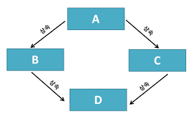

# 01.25.

## 클래스

### 상속

- 기존 클래스의 속성과 메서드를 물려받아 새로운 하위 클래스를 생성
- 이점 : 코드 재사용, 계층 구조, 구체적인 클래스 생성, 유지 보수 용이
- 예시
    
    ```python
    class Person:
        def __init__(self, name, age) -> None:
            self.name = name
            self.age = age
    
        def talk(self):
            print(f"Hello, I'm {self.name}")
    
    class Professor(Person):
        def __init__(self, name, age, department) -> None:
            super().__init__(name, age)
            self.department = department
    
    class Student(Person):
        def __init__(self, name, age, gpa) -> None:
            super().__init__(name, age)
            self.gpa = gpa
    
    p1, s1 = Professor('Park', 49, 'Computer Science'), Student('Kim', 22, 4.0)
    
    p1.talk() # Hello, I'm Park
    print(p1.department) # Computer Science
    s1.talk() # Hello, I'm Kim
    print(s1.gpa) # 4.0
    ```
    
- `super()`는 부모 클래스 객체를 반환하는 내장 함수
    - 유지 관리 용이성
    - 다중 상속 구조 문제 방지
- 다중 상속
    - 여러 개의 부모 클래스를 가짐
    - 중복된 속성이나 메서드는 상속 순서에 따라 결정
        
        ```python
        class Person:
            def __init__(self, name) -> None:
                self.name = name
        
            def greeting(self):
                return f"Hello, I'm {self.name}"
        
        class Dad(Person):
            gene = 'XY'
        
            def walking(self):
                return "Dad is walking"
            
        
        class Mom(Person):
            gene = 'XX'
        
            def swimming(self):
                return "Mom is swimming"
            
        
        class Baby(Dad, Mom):
            def swimming(self):
                return "Baby is swimming!"
            
            def crying(self):
                return "Crying Baby"
            
        
        baby1 = Baby("UWU")
        print(baby1.crying()) # Crying Baby
        print(baby1.swimming()) # Baby is swimming!
        print(baby1.walking()) # Dad is walking
        print(baby1.greeting()) # Hello, I'm UWU
        print(baby1.gene) # XY
        ```
        
    - 위 같은 경우를 다이아몬드 문제라고 한다.
        
        
        
    - 파이썬의 경우 MRO(Method Resolution Order) 알고리즘 사용
        - 오른쪽에 있는게 먼저 불러와 짐 → 왼쪽 걸로 덮어쓰여짐
    - `super()`도 마찬가지 순서
        
        ```python
        class A:
            def __init__(self) -> None:
                print('A')
        
        class B(A):
            def __init__(self) -> None:
                super().__init__()
                print('B')
        
        class C(A):
            def __init__(self) -> None:
                super().__init__()
                print('C')
        
        class D(B, C):
            def __init__(self) -> None:
                super().__init__()
                print('D')
        
        d = D()
        # A
        # C
        # B
        # D
        # mro는 그대로지만 호출이 역순으로 됨 (call stack)
        ```
        

## 에러와 예외 (Error & Exception)

- 버그
    - 소프트웨어에서 발생하는 오류 or 결함
    - 예상된 동작과 실제 동작 사이 불일치
- 디버깅
    - 버그를 찾아내고 수정하는 과정

### 에러

- 프로그램 실행 중 발생하는 예외사항
- 유형
    - SyntaxError - 문법 에러
        - Invalid syntax
        - assign to literal
        - EOL
        - EOF
    - Exception - 예외
        - 내장 예외
- 내장 예외 종류 - [https://docs.python.org/ko/3/library/exceptions.html](https://docs.python.org/ko/3/library/exceptions.html)
    - ZeroDivisionError
    - NameError
    - TypeError
    - ValueError
    - IndexError
    - KeyError
    - ModuleNotFoundError
    - ImportError
    - KeyBoardInterrupt
    - IndentationError
    - etc

### 예외 처리

- `try`, `except`사용
    
    ```python
    try:
        # body code which can raise exception
        pass
    
    except exception: # optional var
        # code which run when some exception raise
        pass
    ```
    
- 여러 예외들을 각각 명시적으로 처리할 때는 하위 예외 클래스들부터 작성
- `as`로 예외를 변수에 할당하여 사용 가능
    - `except exception as var`

### EAFP vs LBYL

- 예외 처리와 값 검사에 대한 2가지 접근 방식
- EAFP
    - Easier to Ask for Forgiveness than Permission
    - 예외처리 중심
    - 실행 후 예외 처리
    - `try`, `except`사용
        
        ```python
        my_dict = {}
        
        try:
            result = my_dict['key']
            print(result)
        except:
            print("Key doesn't exist.")
        ```
        
    - 예외 상황을 예측하기 어려울 때 유용
- LBYL
    - Look Before You Leap
    - 값 검사 중심
    - 실행 전 예외 상황 검사
    - `if`, `else`사용
        
        ```python
        my_dict = {}
        
        if 'key' in my_dict.keys():
            result = my_dict['key']
            print(result)
        else:
            print("Key doesn't exist.")
        ```
        
    - 미리 예외 상황을 방지하고 싶을 때 유용